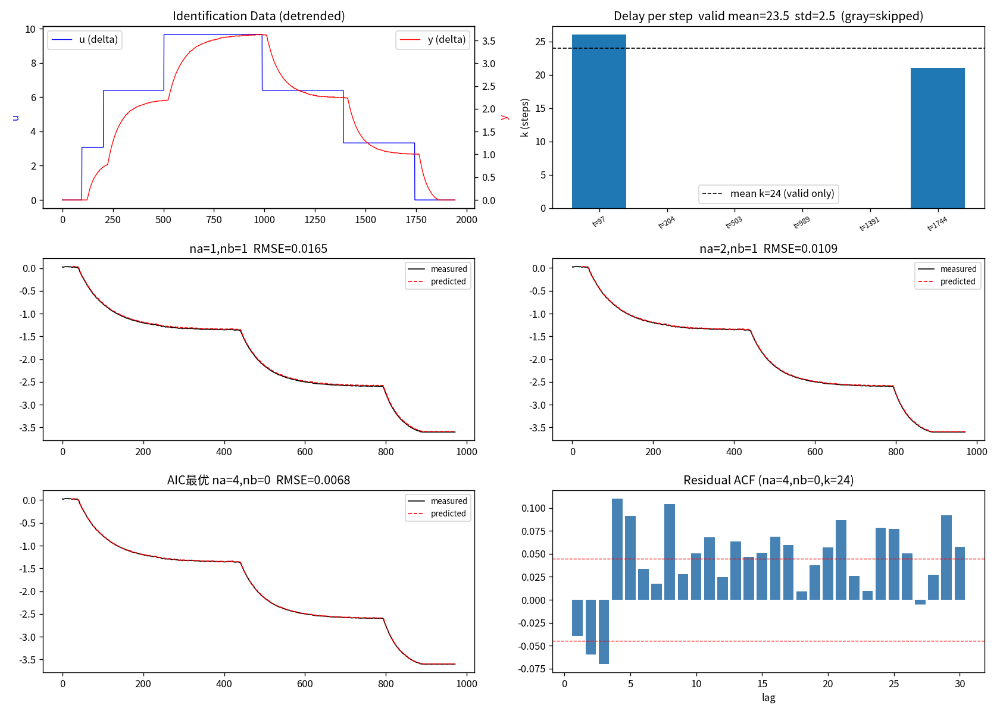
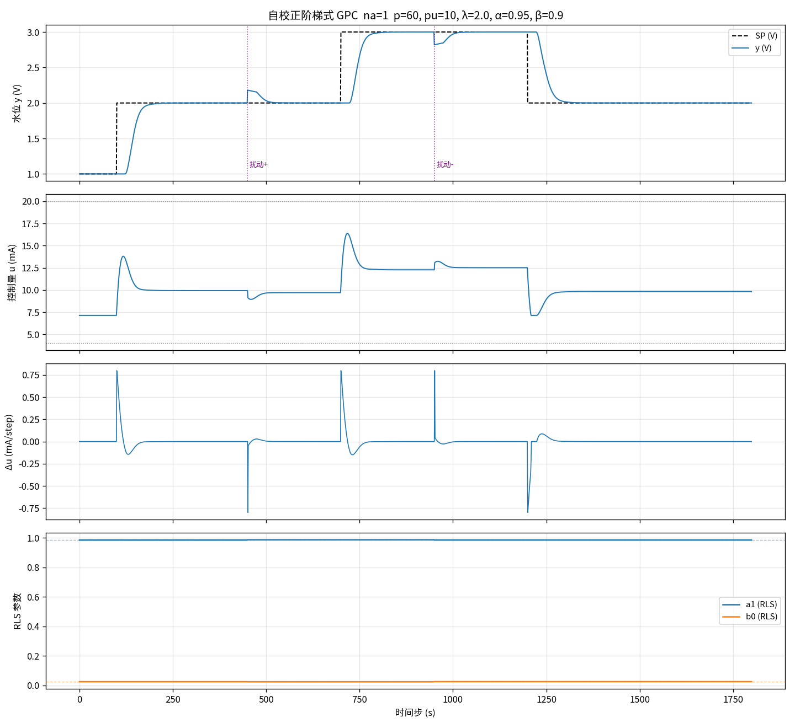
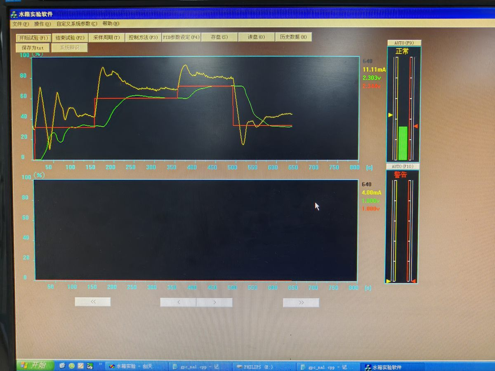

# nota

> 把课堂讲义、文献阅读、项目归纳变成结构化可浏览的 HTML 笔记 — 作为 coding agent skill 使用。
>
> 📖 **English version**: [README.md](README.md)

[](LICENSE)


**这是一个 coding agent skill，不是托管服务。** 支持 Claude Code、Cursor、Codex CLI、OpenClaw 或任何支持 skill 的编辑器环境。无云端，无注册，无遥测。

---

## 它能做什么

nota 把知识打包成单文件 HTML，内含 MathJax 公式渲染、代码高亮、折叠证明块、侧边目录——任何设备可读，离线可用，无需构建步骤。

四个典型场景：

| 场景 | 你给 agent 的东西 | 你得到的东西 |
|---|---|---|
| **课堂笔记** | PDF 课件 / 手写扫描 | 含定理、证明、例题的结构化 HTML |
| **文献阅读** | arXiv PDF | 逐节拆解 + 关键公式 + Q&A 折叠块 |
| **项目归纳** | 自己的笔记 / 实验日志 | 提炼后的方法论、结果、工程实现 |
| **学术海报** | 以上任意内容 | 通过 `poster_print` 模板生成打印级 A1/A2 海报 |

---

## 示例展示

### 课堂笔记：代数基础 Lecture 10

*代数基础 Lecture 10：Hermitian 矩阵与正交投影*，从课程 PDF 端到端生成。

涵盖：Courant-Fischer 定理 · Hermitian 矩阵特征值夹逼不等式 · Schur 三角化 · 正规矩阵 · 正交投影矩阵，所有证明完整展开在折叠块中，带两级可跳转目录。

| 主题版本 | 链接 |
|---|---|
| Default 主题 | [`examples/alg_lecture10-default.html`](examples/alg_lecture10-default.html) |
| Dark 主题 | [`examples/alg_lecture10-dark.html`](examples/alg_lecture10-dark.html) |

### 项目归纳：水箱液位 GPC 控制实验

多文件结构示例（index + 7个章节页），涵盖完整项目流程：

**理论 → 实验适配推导 → 校核 → 仿真验证 → 工程实现（C++）**

<p align="center">
  
  
  
</p>

<p align="center">
  <em>系统辨识（ARX 模型验证）    ·     仿真实验（闭环阶跃响应）  ·    实际测试（硬件在环）</em>
</p>

包含：ARX 系统辨识 · CARIMA 模型 · 丢番图递推 · 阶梯式 GPC · RLS 在线辨识 · Bug 记录 · 调参速查表。

→ [`examples/water_tank_gpc/index.html`](examples/water_tank_gpc/index.html)

---

## Skill 列表

克隆后将 `skills/` 目录指向你的 agent，五个 skill 即可使用：

| Skill | 触发方式 | 功能 |
|---|---|---|
| `notes-new` | `/notes-new` | 从源材料（PDF / 文本 / 描述）新建笔记 |
| `notes-update` | `/notes-update` | 追加 Q&A 块、新增章节、修改已有内容 |
| `notes-theme` | `/notes-theme` | 单文件或整目录切换主题 |
| `notes-snapshot` | `/notes-snapshot` | Git tag 存档当前版本，支持回滚 |
| `notes-index` | `/notes-index` | 重建所有笔记的导航索引页 |

---

## 模板

三套开箱即用模板：

| 模板 | 适用场景 |
|---|---|
| `academic_lecture` | 多章节课程笔记、速查手册 — 侧边 TOC、callout 块、代码折叠 |
| `minimal_slide` | 单主题论文笔记、轻量阅读记录、多文件项目笔记 |
| `poster_print` | A1/A2 双栏打印海报 — MathJax、`@page` 精确尺寸输出 |

---

## 主题

| 主题 | 状态 | 配色描述 |
|---|---|---|
| `default` | ✅ 已实现 | 灰红学术配色 |
| `dark` | ✅ 已实现 | 深色背景，红蓝强调色 |
| `solarized` | 🚧 即将上线 | Solarized Light 暖黄底色 |
| `custom` | ✅ 可用 | 自填 CSS 变量入口 |

---

## 快速上手

```bash
# 克隆到 agent 的 skill 目录
git clone https://github.com/straw-cpu/nota ~/.claude/skills/nota

# 在 agent 中使用：
/notes-new --template academic_lecture --title "我的讲义" --source lecture.pdf
```

agent 读取源材料，生成包含所有定理 / 证明 / 例题的完整 HTML，保存到本地。克隆后无需联网。

---

## 目录结构

```
nota/
├── skills/
│   ├── notes-new/        ← 从源材料新建笔记
│   ├── notes-update/     ← 编辑 / 扩展已有笔记
│   ├── notes-theme/      ← 切换主题
│   ├── notes-snapshot/   ← git tag 存档
│   └── notes-index/      ← 重建导航索引
├── templates/
│   ├── academic_lecture.html
│   ├── minimal_slide.html
│   └── poster_print.html
├── themes/
│   ├── default.css
│   ├── dark.css
│   └── custom.css
├── tools/
│   ├── build_index.py    ← 扫描 HTML，生成导航页
│   └── theme_switch.py   ← 批量主题替换
└── examples/
    ├── alg_lecture10-default.html
    ├── alg_lecture10-dark.html
    └── water_tank_gpc/   ← 多文件项目示例
```

---

## 致谢

HTML 模板结构与视觉设计参考了两个开源项目：

- **[ARIS-in-AI-Offer](https://github.com/wanshuiyin/ARIS-in-AI-Offer)** — 学术讲义模板布局与 CSS 变量规范
- **[posterly](https://github.com/Chenruishuo/posterly)** — 海报打印模板与 `@page` 尺寸方案

两者均为 MIT 协议。nota 借鉴了其视觉风格，skill 工作流与内容生成流程独立实现。

---

## License

MIT. 详见 [LICENSE](LICENSE)。
